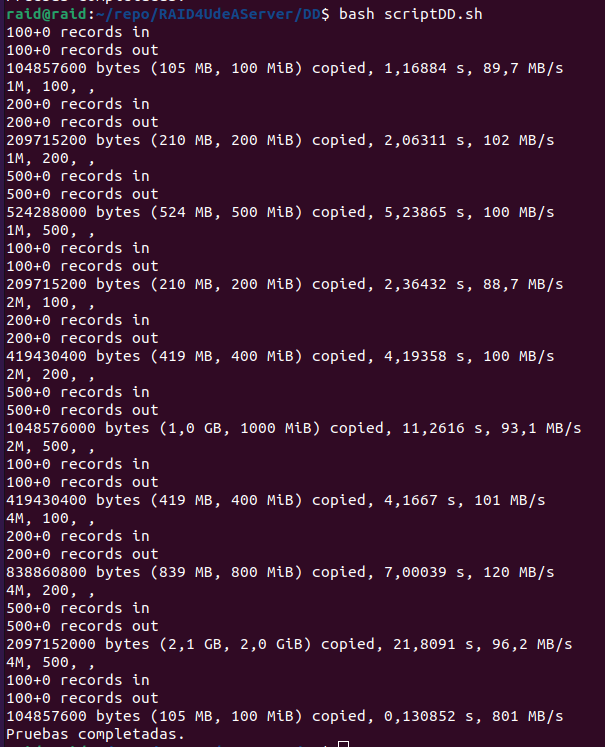

# Bencharmark de DD

El benchmark de disco duro (DD) es una herramienta utilizada para evaluar el rendimiento de un conjunto RAID (Redundant Array of Independent Disks, o conjunto redundante de discos independientes). Un RAID combina múltiples discos duros en un solo sistema para mejorar la velocidad, la capacidad o la tolerancia a fallos.

El benchmark de DD se utiliza para medir la velocidad de transferencia de datos, el tiempo de acceso a los datos y otros parámetros relacionados con el rendimiento de los discos duros en un RAID. Esto proporciona información valiosa sobre el desempeño general del conjunto RAID y puede ayudar a identificar posibles cuellos de botella o áreas de mejora.

Al realizar un benchmark de DD en un RAID, generalmente se utilizan aplicaciones específicas o utilidades diseñadas para medir el rendimiento de los discos duros. Estas herramientas generan una serie de pruebas y mediciones, como la velocidad de lectura/escritura secuencial y aleatoria, el rendimiento de entrada/salida por segundo (IOPS), el tiempo medio de búsqueda (latencia), entre otros.

Los resultados del benchmark de DD pueden compararse con los resultados de referencia o con otros sistemas RAID similares para evaluar el rendimiento relativo. También pueden utilizarse para detectar posibles problemas, como discos duros defectuosos o configuraciones subóptimas.

Es importante tener en cuenta que el rendimiento de un RAID no solo depende de los discos duros utilizados, sino también de otros factores como el controlador RAID, la configuración del RAID, el tamaño de la caché y el sistema operativo. Por lo tanto, el benchmark de DD es una herramienta útil para evaluar el rendimiento de los discos duros en un RAID, pero no proporciona una imagen completa del rendimiento general del sistema.

## Pruebas de DD benchmark hechas con .sh

### Prueba 1


Esta prueba se realizó con el comando `sudo dd if=/dev/zero of=./dd/archivo_salida bs=1M count=directconv=fdatasync`

### Prueba 2


Esta prueba se realizó con el RAID 0. En uno de los discos duros de 1TB.

Para realizar esta prueba es necesario tener en cuenta los siguientes archivos:


Donde el archivo `scriptDD.sh` contiene el siguiente código:

```bash
#!/bin/bash
# Configuración de variables
archivo_salida="resultado.csv"
tamanos_bloques=("1M" "2M" "4M")
cantidades_bloques=("100" "200" "500")

# Encabezado del archivo CSV
echo "Tamaño Bloque, Cantidad Bloques, Tiempo, Temperatura" > $archivo_salida

# Bucle para ejecutar las pruebas con diferentes configuraciones
for tamano_bloque in "${tamanos_bloques[@]}"
do
    for cantidad_bloques in "${cantidades_bloques[@]}"
    do
        tiempo=$(sudo dd if=/dev/zero of=./archivo_salida bs=$tamano_bloque count=$cantidad_bloques 2>&1 | grep "elapsed" | awk '{print $NF}')
        temperatura=$(sensors | grep "RAID Temperature" | awk '{print $3}')
        echo "$tamano_bloque, $cantidad_bloques, $tiempo, $temperatura"
        echo "$tamano_bloque, $cantidad_bloques, $tiempo, $temperatura" >> $archivo_salida
    done
done
sudo dd if=/dev/zero of=./archivo_salida bs=1M count=100
echo "Pruebas completadas."
```

El archivo `scriptDD.sh` se encarga de ejecutar las pruebas y guardar los resultados en el archivo `resultado.csv` (el cual se crea automáticamente al correr el script).

Además, en el archivo `archivo_salida` se encuentran los datos que se escriben en el disco duro, los cuales son traidos desde `/dev/zero`. Este archivo también se crea automáticamente al correr el script.

### Prueba 3

Se realizó una prueba sobre el disco H, el cual es un disco de 1TB. Se realizó con el RAID 0.


Para realizar la prueba, se asigno la variable "of" la cual tenía la ruta del disco H: `of=/mnt/discoh/`

### Prueba 4

Se realizó una prueba sobre sdc y sdd. Se realizó con el RAID 1.





## Script con Python

Se realiza el cambio de lenguaje, ya que python es más fácil de leer y de entender, además que simplifica el código. Esto ayuda bastante a la hora de realizar pruebas y de hacer cambios en el código. Y permite guardar los datos en un archivo CSV de manera ordenada.

```python

import subprocess
import csv
import datetime
import re

def get_dd_speed(command):
    result = subprocess.run(command, shell=True, capture_output=True, text=True)
    output = result.stderr.strip()

    # Utilizar expresiones regulares para extraer los valores
    time_match = re.search(r'(\d+\.\d+)\s+s,', output)
    speed_match = re.search(r'(\d+)\s+MB/s', output)

    # Obtener el tiempo y la velocidad de escritura secuencial
    time = time_match.group(1) if time_match else ''
    sequential_write = speed_match.group(1) if speed_match else ''

    # Convertir la velocidad de escritura a KB/s
    sequential_write = str(float(sequential_write) * 1024) if sequential_write else ''
    sequential_read = sequential_write

    return sequential_write, sequential_read, time


def write_to_csv(data):
    with open('dd_results.csv', 'a', newline='') as csvfile:
        writer = csv.writer(csvfile)
        if not csvfile.tell():
            writer.writerow(['BenchmarkName', 'DiskName', 'Test', 'Replica', 'file_size_in', 'reg_size_in',
                             'sequential_write (KB/s)', 'random_write(KB/s)', 'random_rewrite(KB/s)', 'random_read(KB/s)',
                             'time(s)', 'timestamp(s)', 'sequential_read (KB/s)'])
        writer.writerow(data)


def run_experiment(file_size, chunk_size, replicas):
    for replica in range(replicas):
        print(f"Iniciando prueba con file_size={file_size}, chunk_size={chunk_size}, Réplica {replica + 1}")
        start_time = datetime.datetime.now()

        # Eliminar la letra "M" o "K" de file_size y chunk_size
        file_size_numeric = file_size[:-1]
        chunk_size_numeric = chunk_size[:-1]

        # Convertir file_size_numeric y chunk_size_numeric a KB/s
        file_size_numeric = str(int(file_size_numeric) * 1024)
        chunk_size_numeric = str(int(chunk_size_numeric) * 1024)

        command = f"dd if=/dev/zero of={output_file} bs={chunk_size} count={file_size}"
        sequential_write, sequential_read, time = get_dd_speed(command)
        timestamp = datetime.datetime.now().strftime("%Y-%m-%d %H:%M:%S")

        write_to_csv(['DD',output_file,experiment_number, replica + 1, file_size_numeric, chunk_size_numeric, sequential_write, '0', '0', '0',
                      time, timestamp, sequential_read])

        print(f"Prueba con file_size={file_size}, chunk_size={chunk_size}, Réplica {replica + 1} finalizada")


# Definir los parámetros del diseño experimental
file_sizes = ['1M', '4M', '16M', '32M', '64M', '1024M']
chunk_sizes = ['4k', '8k', '16k']
replicas = 5
output_file = '/mnt/md0/archivo_salida'
experiment_number = 1

# Ejecutar el diseño experimental
for file_size in file_sizes:
    for chunk_size in chunk_sizes:
        run_experiment(file_size, chunk_size, replicas)
        experiment_number += 1

print("Las pruebas con DD han concluido con éxito")


```

El script anterior se encarga de ejecutar las pruebas y guardar los resultados en el archivo `dd_results.csv` (el cual se crea automáticamente al correr el script).

Además, en el archivo `archivo_salida` se encuentran los datos que se escriben en el disco duro, los cuales son traidos desde `/dev/zero`. Este archivo también se crea automáticamente al correr el script.

Para ejecutar el script, se debe ejecutar el siguiente comando:

```bash
python3 dd.py
```

## Resultados

Los resultados de las pruebas se encuentran en el archivo `dd_results.csv`.
Este archivo se encuentra en la carpeta `DD`.

## Dificultades

Al momento de realizar las pruebas, se presentaron las siguientes dificultades:

- El archivo `scriptDD.sh` no se ejecutaba correctamente. Esto se debía a que el archivo no tenía permisos de ejecución. Para solucionar esto, se ejecutó el comando `chmod +x scriptDD.sh` para darle permisos de ejecución al archivo.
- El archivo `scriptDD.sh` limitaba la ejecución de pruebas automatizadas, así que para tener una mayor flexibilidad a la hora de realizar las pruebas, se decidió usar Python, y se creó el archivo `dd.py`.
- La carpeta "discoh" no se podría crear, dentro del disco sdh:
  
  Así que se tuvo que usar el comando -t y ext4 para crear la carpeta.
  